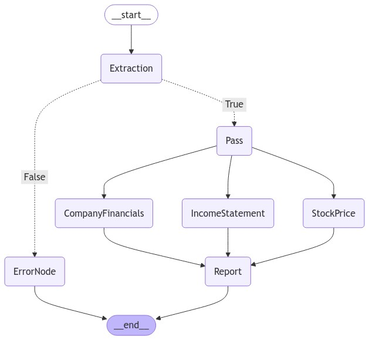

# Alexander Gurevich
I'm naturally curious and a forward-thinking leader with a unique combination of business and technical skills and over 20 years of experience in software engineering and development. I bring extensive knowledge of the financial industry to my work. Currently, I am focused on Generative AI and ML.

* Love talking to customers and Skilled at identifying business challenges and addressing them with technological solutions.
* Expert in managing remote software development projects and teams across time zones (USA & Europe) using agile methodologies and collaborative tools for seamless communication.

Currently I am looking for opportunity where I can apply my skills to bring business value through leveraging technology, especially AI

# Projects

### Classification Models
<table>
  <tr>
    <td align="center" width="33%">
      <h3>Comparing accuracy of fine-tuned ALBERT type of model vs. Sentence transformer</h3>
      

      <!--  -->
       
      <a href="https://github.com/agdev/Routing.git">View on GitHub</a>
        
      <small>ALBERT | Semantic router | Sentence transformers | Customer Segments </small>
    </td>
    <td></td>
  </tr>
  <tr>
    <td> <h3>
Generative AI
</h3></td>
  </tr>
  <tr>
    <td align="center" valign="top" width="33%">
      <h3>Financial Report.</h3>
      
 Financial Agentic System: Combining Langgraph, GROQ, and APIs for Intelligent Financial Analysis
      

      
       
      <a href="https://github.com/agdev/Langgraph/tree/main/FinancialReport">View on GitHub</a>
        
      <small>Langchain | Langgraph</small>
    </td>
    <td align="center" valign="top" width="33%">
      <h3>Chatting with Pdf file. </h3>
      
LLamaparser as a source for RAG/Context of an LLM

      
       
      <a href="https://github.com/agdev/Llamaindex.git">View on GitHub</a>
        
      <small>LLamaparser | Langchain</small>
    </td>
  </tr>
   <tr>
    <td> <h3>
NLP
</h3> </td>    
    <tr>
    <td align="center" width="33%">
      <h3>Routing</h3>
      
Compares accuracy of fine-tuned [ALBERT](https://arxiv.org/abs/1909.11942) type of model vs. [Semantic router](https://github.com/aurelio-labs/semantic-router/) to optimize routing of a user's request/prompt

      
       
      <a href="https://github.com/agdev/Routing">View on GitHub</a>
        
      <small>ALBERT | Fine Tuning | Sentence Transformer</small>
    </td>
    <td></td>
  </tr>
  </tr>
  <tr>
    <td> <h3>
Machine Learning
</h3> </td>
  </tr>
  <tr>
    <td align="center" width="33%">
      <h3>Customer Segmentation</h3>
      
Based on selected features and KMeans clustering provides actionable insights into customer preferences and behavior patterns, which will ultimately drive more effective customer engagement and increase profitability.

      
       
      <a href="https://github.com/SuperDataScience-Community-Projects/SDS-CP008-superstore-customer-segmentation.git/notebooks/alex">View on GitHub</a>
        
      <small>KMeans | Unsupervised classification | Customer Behavior</small>
    </td>
    <td></td>
  </tr>
  <tr>
    <td> <h3>
Tools
</h3> </td>
  </tr>
  <tr>    
    <td align="center" width="33%">
      <h3>Docker & Kubernetes</h3>
      
Shows usages of Docker alone and together with Kubernetes

      <!--  -->
       
      <a href="https://github.com/agdev/Docker_Kubern.git">View on GitHub</a>
        
      <small>Docker | Kubernetes </small>
    </td>
    <td></td>
  </tr>
 </table>
