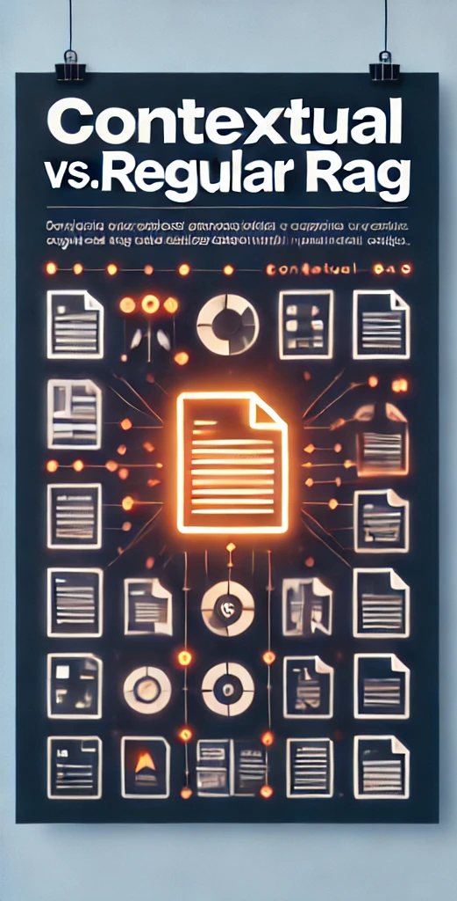
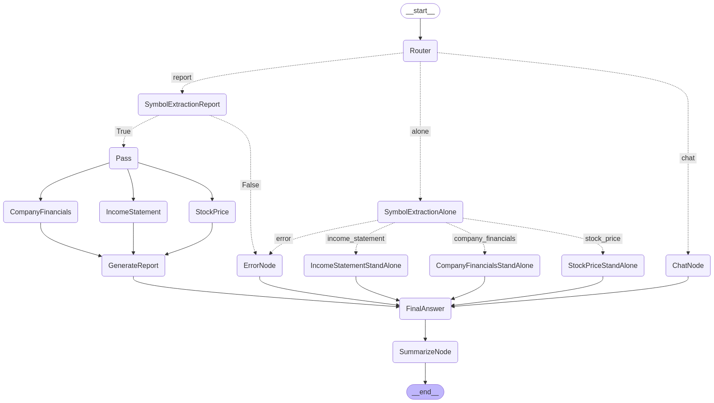
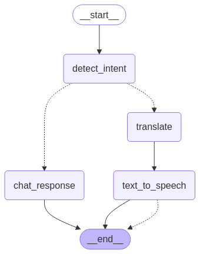
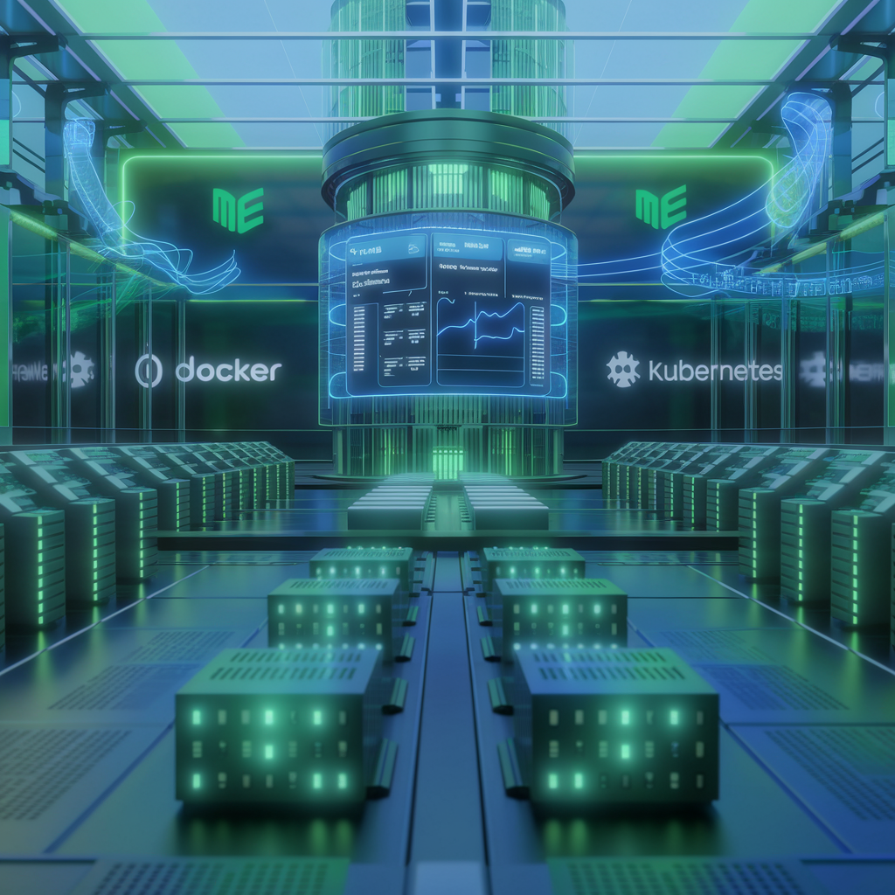

<!-- # Alexander Gurevich -->
***A product-focused technical leader specializing in AI/ML solutions with over 20 years of 
 software engineering expertise with hands-on experience with LangGraph, RAG, and 
 LangChain implementations. Passionate about bridging the gap between 
 technical capabilities and business value, with proven track record of implementing 
 production-ready  systems and leading global teams to transform complex business 
 challenges into high-impact software solutions. Currently focused on developing and 
 deploying generative AI and machine learning applications to enhance business performance 
 through innovative technical solutions.***

***More details on my [Linkedin Profile](https://www.linkedin.com/in/alexandergurevich/)***

# Products

**[Products Portfolio](https://agdev.github.io/Products-Portfolio/)**

# Projects
<table>
  <tr>
    <td> <h3>
Generative AI
</h3></td>
  </tr>
  <tr>
   <td align="center" valign="top" width="33%">
      <h3>Contextual RAG</h3>
      
 Comparison of Contextual Retrieval implementation with "traditional" implementation.
      

      
       
      <a href="https://github.com/agdev/RAG/tree/main/ContextRetrieval">View on GitHub</a>
        
      <small>RAG | Contextual Retrieval | Embedding</small>
    </td>   
    <td align="center" valign="top" width="33%">
      <h3>Financial Assistant.</h3>
      
 Financial Agentic System with Routing and Cross Sessions Memory: Combining Langgraph, GROQ, and APIs for  Free chat, specific tasks and/or report creation
      

      
       
      <a href="https://github.com/agdev/Langgraph/tree/main/FinancialAssistant">View on GitHub</a>
        
      <small>Langchain | Langgraph | Routing | Cross Sessions Memory</small>
    </td>
    <td valign="top">
    <h3>Polyglot - AI Language Learning Assistant</h3>
      
 
        AI Language Learning Assistant that understand textual and audio inputs
        Translates, speaks via audio files and creates vocabulary for future practice
      

      
       
      <a href="https://github.com/agdev/polyglot">View on GitHub</a>
        
      <small>Langchain | Langgraph </small>
    </td>
  </tr>
  <tr>
    <!-- <td align="center" valign="top" width="33%">
      <h3>Financial Report.</h3>
      
 Financial Agentic System: Combining Langgraph, Langchain, GROQ, and APIs for Intelligent Financial Analysis
      

      
       
      <a href="https://github.com/agdev/Langgraph/tree/main/FinancialReport">View on GitHub</a>
        
      <small>Langchain | Langgraph</small>
    </td>    -->    
    <td align="center" valign="top" width="33%">
      <h3>Chatting with Pdf file. </h3>
      
LLamaparser as a source for RAG/Context of an LLM

      
       
      <a href="https://github.com/agdev/Llamaindex.git">View on GitHub</a>
        
      <small>LLamaparser | Langchain</small>
    </td>
  </tr>  
  
   <tr>
    <td> <h3>
NLP
</h3> </td>    
    <tr>
    <td align="center" width="33%">
      <h3>Classification Models</h3>
      
Compares accuracy of fine-tuned 
      <a href="https://arxiv.org/abs/1909.11942">ALBERT</a> type of model vs. 
      <a href="https://github.com/aurelio-labs/semantic-router/">Semantic router</a> to optimize routing of a user's request/prompt

      
       
      <a href="https://github.com/agdev/Routing">View on GitHub</a>
        
      <small>ALBERT | Fine Tuning | Sentence Transformer</small>
    </td>   
    <td> 
    </td>    
    <td> 
    </td>    
  </tr>
  </tr>
  <tr>
    <td> <h3>
Machine Learning
</h3> </td>
  </tr>
  <tr>
    <td align="center" width="33%">
      <h3>Customer Segmentation</h3>
      
Based on selected features and KMeans clustering provides actionable insights into customer preferences and behavior patterns, which will ultimately drive more effective customer engagement and increase profitability.

      
       
      <a href="https://github.com/SuperDataScience-Community-Projects/SDS-CP008-superstore-customer-segmentation.git/notebooks/alex">View on GitHub</a>
        
      <small>KMeans | Unsupervised classification | Customer Behavior</small>
    </td>
    <td></td>
    <td></td>
  </tr>
  <tr>
    <td> <h3>
Tools
</h3> </td>
  </tr>
  <tr>    
    <td align="center" width="33%">
      <h3>Docker & Kubernetes</h3>
      
Shows usages of Docker alone and together with Kubernetes

      
       
      <a href="https://github.com/agdev/Docker_Kubern.git">View on GitHub</a>
        
      <small>Docker | Kubernetes </small>
    </td>
    <td></td>
    <td></td>
  </tr>
 </table>
